<p align="center">
  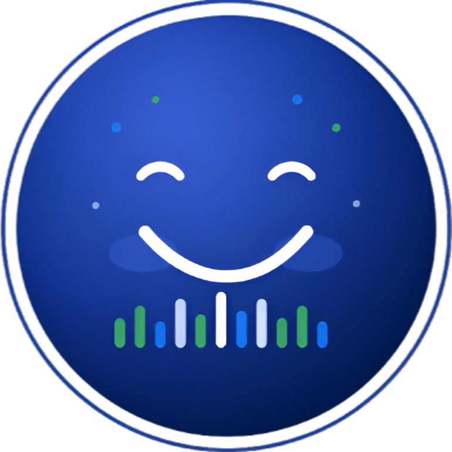
</p>

<h1 align="center">SentiVibe</h1>

<p align="center"><strong>Where Moods Meet Media</strong></p>

<p align="center">
  An AI-powered mobile app that detects how you feel and recommends <strong>music</strong>, <strong>music videos</strong>, and <strong>movies</strong> tailored to your mood.
</p>

<p align="center">
  <a href="https://reactnative.dev"></a>
  <a href="https://www.typescriptlang.org"></a>
  <a href="https://nodejs.org"></a>
  <a href="https://www.python.org"></a>
</p>

---

## What It Does

SentiVibe turns your mood into media recommendations. Tell the app how you feel through **chat**, **camera**, or **voice** — and it curates Spotify tracks, YouTube videos, and movies that match.

| Feature | Description |
|---|---|
| Multimodal mood detection | Text, face, and voice emotion analysis |
| AI chatbot | LLaMA-powered assistant with memory (RAG) |
| Spotify integration | Real mood-based track recommendations |
| YouTube player | In-app music videos and movie trailers |
| Movie picks | Emotion-matched films with IMDb metadata |
| Personalization | Onboarding wizard for music & movie tastes |

---

## Screenshots

### Onboarding & Welcome

| Onboarding | Home Screen |
|:---:|:---:|
| 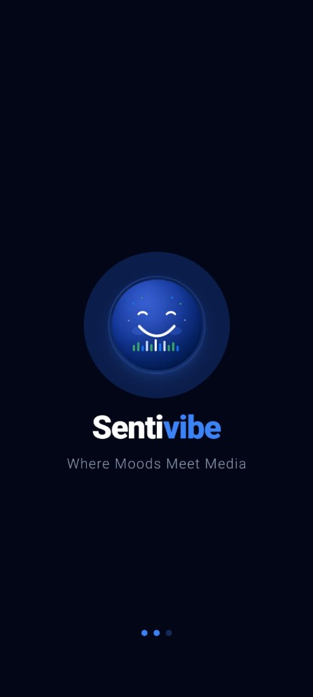 | 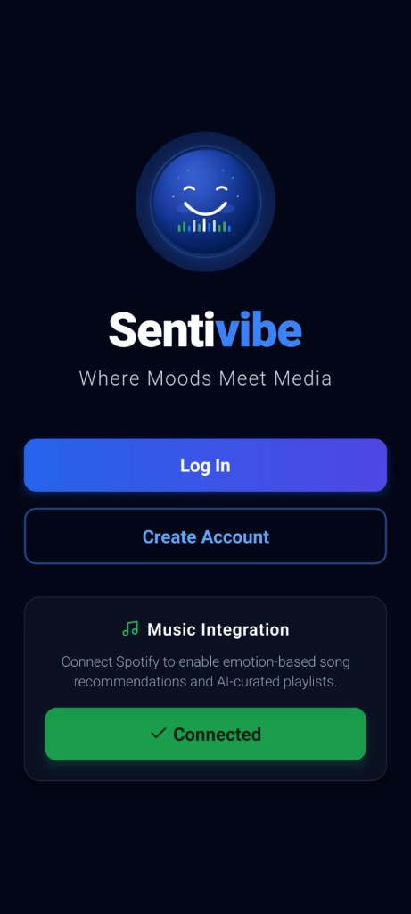 |

### Mood Detection

| AI Chatbot | Voice Detection | Face Detection |
|:---:|:---:|:---:|
| 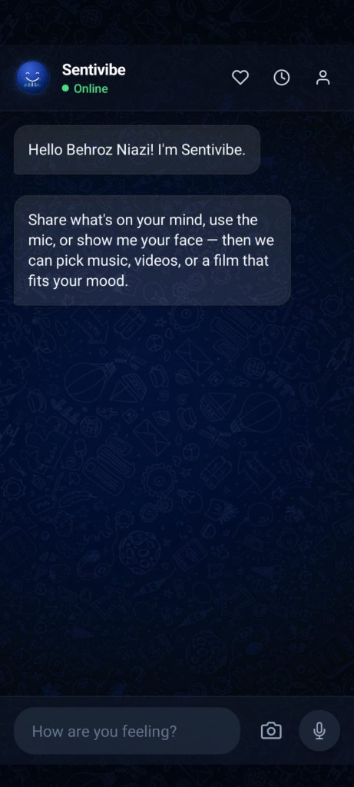 | 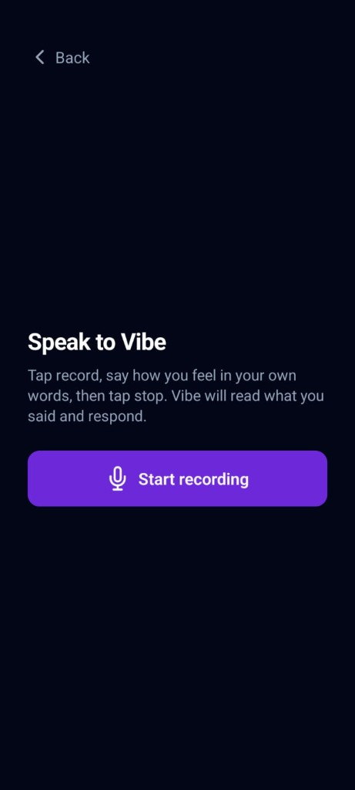 | 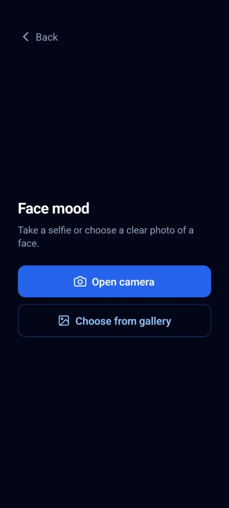 |

### Recommendations & Playback

| Mood Detected | Music Results | Movie Results |
|:---:|:---:|:---:|
| 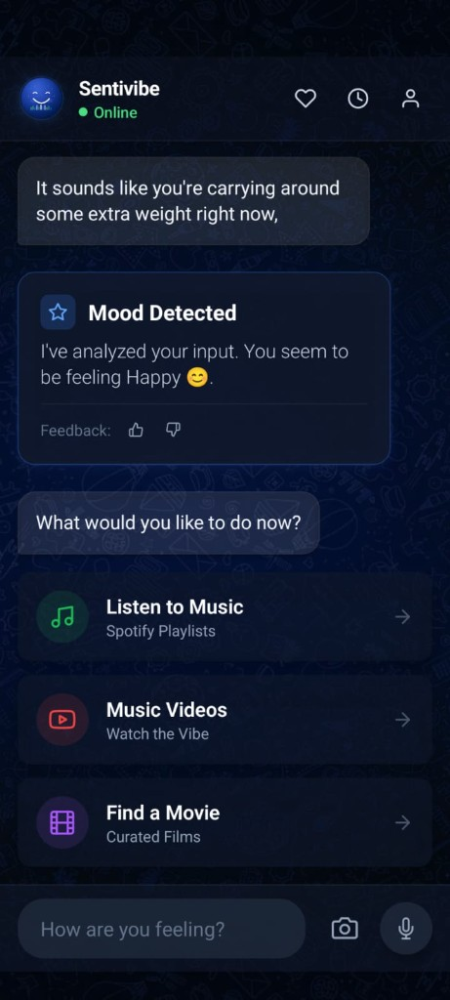 | 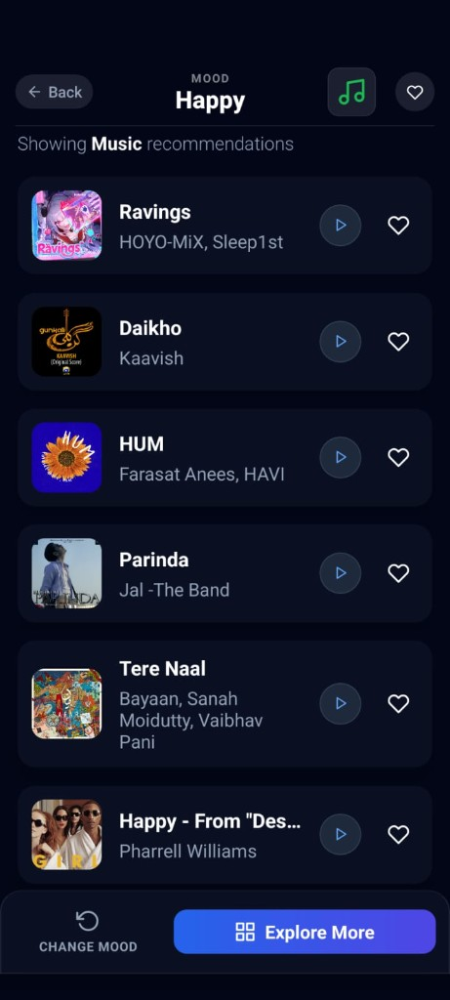 | 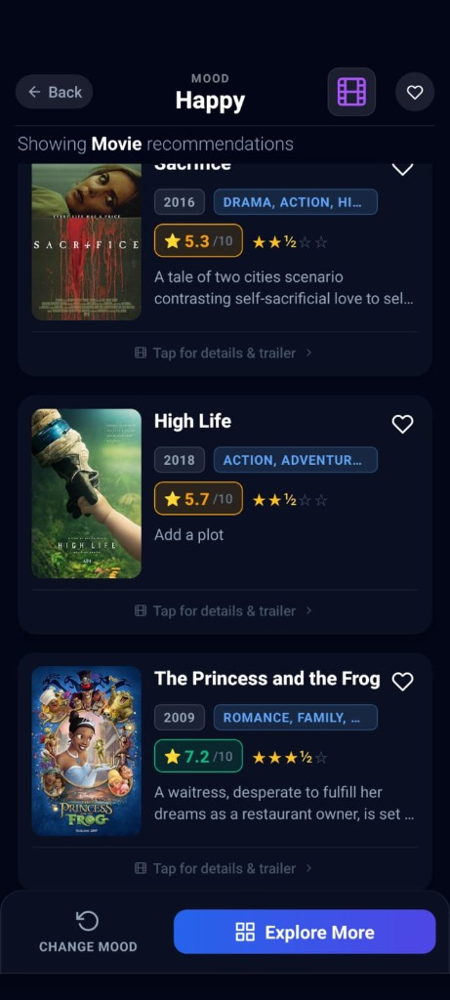 |

| Music Player | Profile |
|:---:|:---:|
| 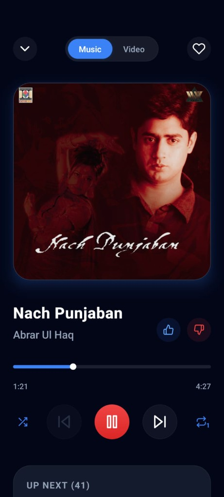 | 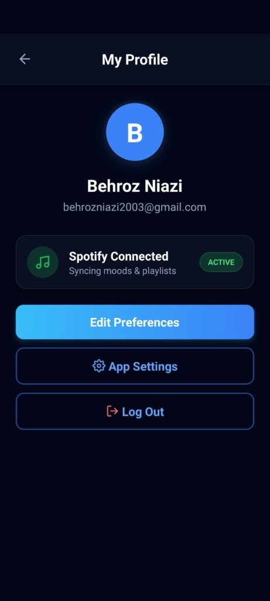 |

---

## Full Documentation

This README is the **GitHub landing page**. For the complete project guide — architecture, API reference, ML models, privacy, deployment, and more — see:

**[docs/PROJECT_OVERVIEW.md](docs/PROJECT_OVERVIEW.md)**

---

## Architecture (at a glance)

```
React Native App  →  Node.js API Gateway (port 3001)  →  Python AI (8000) + Emotion ML (5001)
                              ↓
                    Spotify · YouTube · OMDB · Firebase
```

---

## Quick Start

### Prerequisites

- Node.js 20+
- Python 3.10+
- [React Native dev environment](https://reactnative.dev/docs/set-up-your-environment)
- Ollama with `llama3.2:1b`
- API keys: Spotify, YouTube, Firebase

### Install & Run

```bash
# Clone
git clone https://github.com/YOUR_ORG/sentivibe.git
cd sentivibe

# Mobile app
npm install

# Backend
cd backend && npm install && cp .env.example .env && cd ..

# Python AI (see docs/PROJECT_OVERVIEW.md for full pip list)
cd python-ai && pip install -r requirements.txt 2>/dev/null || pip install flask flask-cors transformers deepface scikit-learn pandas sentence-transformers faiss-cpu requests && cd ..
```

Start all services (4 terminals):

```bash
ollama serve                                          # Terminal 1
cd python-ai && python ai_server.py                   # Terminal 2
cd backend && npm run dev                             # Terminal 3
npm start                                             # Terminal 4 — Metro
```

Run the app:

```bash
npm run android    # or: npm run ios
```

> Physical devices: update `BASE_URL` in `src/services/api.ts` with your machine IP or ngrok URL.  
> Full setup details → [docs/PROJECT_OVERVIEW.md#getting-started-developers](docs/PROJECT_OVERVIEW.md#getting-started-developers)

---

## Project Structure

```
sentivibe/
├── src/              # React Native app (screens, components, services)
├── backend/          # Node.js Express API gateway
├── python-ai/        # LLaMA chatbot, emotion detection, movie recommender
├── android/          # Android native project
├── ios/              # iOS native project
└── docs/
    ├── PROJECT_OVERVIEW.md   # Full documentation
    └── media/
        ├── logo.png          # App logo
        └── screenshots/      # App screenshots
```

---

## Tech Stack

| Layer | Technologies |
|---|---|
| Mobile | React Native, TypeScript, React Navigation, Firebase |
| Backend | Express, Spotify API, YouTube API, node-cache |
| AI / ML | Ollama (LLaMA 3.2), FAISS RAG, DistilRoBERTa, DeepFace, TF-IDF |

---

## Contributing

1. Fork the repo
2. Create a branch: `git checkout -b feature/your-feature`
3. Commit your changes
4. Open a Pull Request

See [docs/PROJECT_OVERVIEW.md#contributing](docs/PROJECT_OVERVIEW.md#contributing) for conventions.

---

<p align="center">
  <br>
  <strong>SentiVibe</strong> — Where Moods Meet Media
</p>
