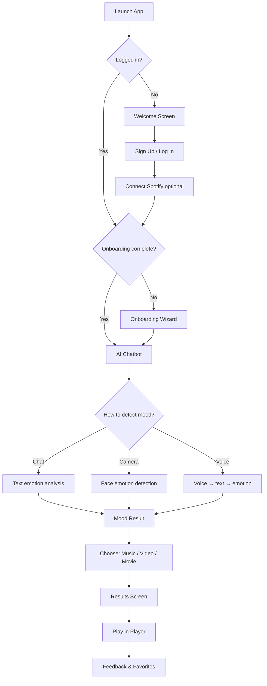

<p align="center">
  
</p>

<h1 align="center">SentiVibe — Project Overview</h1>

<p align="center"><strong>Where Moods Meet Media</strong></p>

<p align="center">
  An AI-powered mobile app that detects how you feel and recommends music, videos, and movies tailored to your mood.
</p>

---

## Table of Contents

1. [What Is SentiVibe?](#what-is-sentivibe)
2. [Visual Showcase](#visual-showcase)
3. [Key Features](#key-features)
4. [How It Works (User Journey)](#how-it-works-user-journey)
5. [System Architecture](#system-architecture)
6. [Technology Stack](#technology-stack)
7. [Project Structure](#project-structure)
8. [Screens & Navigation](#screens--navigation)
9. [AI & Machine Learning](#ai--machine-learning)
10. [API Reference](#api-reference)
11. [Data & Privacy](#data--privacy)
12. [Getting Started (Developers)](#getting-started-developers)
13. [Environment Variables](#environment-variables)
14. [Deployment Notes](#deployment-notes)
15. [Contributing](#contributing)
16. [License & Credits](#license--credits)

---

## What Is SentiVibe?

**SentiVibe** is a cross-platform mobile application (Android & iOS) that bridges emotional intelligence and media discovery. Instead of scrolling endlessly through catalogs, users tell the app how they feel — through conversation, text, facial expression, or voice — and receive curated **music**, **music videos**, and **movie** recommendations aligned with that mood.

### The Problem It Solves

People often know they want to watch or listen to *something*, but not *what*. Mood is a powerful signal for media choice, yet most streaming platforms treat discovery as a search or genre problem. SentiVibe treats it as an **emotion-first** experience.

### Who It's For

- Anyone who wants personalized music and film suggestions without manual browsing
- Users who enjoy conversational AI interfaces
- People curious about multimodal emotion detection (text, face, voice)
- Developers interested in a full-stack AI + mobile integration example

### Core Value Proposition

| Capability | Benefit |
|---|---|
| Multimodal mood detection | Express yourself however feels natural — chat, camera, or voice |
| Spotify integration | Real tracks from your connected account, not static playlists |
| YouTube playback | Watch official music videos and trailers in-app |
| Movie recommendations | Emotion-matched films with IMDb metadata and trailers |
| Personalization | Onboarding wizard learns your genres, artists, and movie tastes |
| AI chatbot with memory | LLaMA-powered assistant remembers context via RAG |

---

## Visual Showcase

Screenshots of the SentiVibe app, organized in the order a user experiences them.

### 1. Onboarding & Welcome

| Onboarding Splash | Home Screen |
|---|---|
| The branded splash screen shown on first launch. | Welcome screen with login, sign-up, and Spotify connection. |
|  |  |

### 2. AI Chatbot & Mood Detection

| Chatbot (Before Detection) | Voice Detection | Face Detection |
|---|---|---|
| The AI assistant greets the user and offers text, voice, or camera input. | "Speak to Vibe" — record a short voice message to detect mood. | "Face mood" — take a selfie or pick a photo for facial emotion analysis. |
|  |  |  |

### 3. Mood Result & Recommendations

| Emotion Detected | Music Recommendations | Movie Recommendations |
|---|---|---|
| After analysis, the chatbot confirms the mood and offers Music, Video, or Movie options. | Spotify-curated tracks matched to the detected mood (e.g. Happy). | Emotion-matched films with IMDb ratings, genres, and trailers. |
|  |  |  |

### 4. Playback & Profile

| Music Player | Profile |
|---|---|
| Full-screen player with album art, progress bar, queue, shuffle, and repeat controls. | User profile with Spotify status, preferences, settings, and logout. |
|  |  |

---

## Key Features

### Authentication & Accounts
- Email/password sign-up and login via **Firebase Authentication**
- User profiles stored in **Cloud Firestore** (name, preferences, mood history)
- Persistent sessions — auto-login on app restart

### Spotify Integration
- OAuth connection from the Welcome screen
- Mood-based track recommendations using Spotify audio features (valence, energy, tempo)
- Personalized recommendations when user preferences are synced
- In-app playback control via Spotify Web API (when connected)

### Multimodal Emotion Detection
- **Text** — DistilRoBERTa emotion classifier on chat messages
- **Face** — DeepFace CNN on camera captures or gallery photos
- **Voice** — Distil-Whisper speech-to-text, then text emotion analysis
- Detected moods map to app labels: Happy, Sad, Angry, Calm, Anxious, Excited, Lonely, Focused, Romantic, Neutral

### AI Chatbot
- Powered by **LLaMA 3.2** (via Ollama) with structured JSON responses
- **RAG (Retrieval-Augmented Generation)** — FAISS + SentenceTransformers per-user memory
- Conversational mood discovery with guided choice buttons
- Off-topic guardrails to keep responses on-brand

### Media Recommendations
- **Music** — Spotify tracks matched to mood + user genre preferences
- **Videos** — YouTube music video IDs resolved for each track
- **Movies** — TF-IDF + cosine similarity over a curated emotion-tagged dataset; enriched with OMDB/IMDb metadata (poster, rating, cast, synopsis)
- Offline fallback to cached recommendations when the network is unavailable

### In-App Player
- Single **YouTube iframe** instance for both audio and video modes
- Album art display in music mode; full 16:9 player in video mode
- Queue management, shuffle, repeat, seek, skip next/previous
- Spotify playback integration for connected users

### Personalization Onboarding
6-step wizard collecting:
- Favorite music genres
- Preferred artists
- Energy preferences per mood (e.g., sad → "Let it out" vs "Uplift me")
- Language preferences
- Favorite movie genres
- Movie-night vibe

### User Library
- **Favorites** — Save movies and media items
- **History** — Past mood sessions and media choices
- **Profile** — Account info, Spotify status, preference editing
- **Settings** — Privacy policy, chat reset, logout

---

## How It Works (User Journey)



### Step-by-Step (Plain Language)

1. **Open the app** — Splash screen checks if you're already logged in.
2. **Create an account** or log in with email and password.
3. **Connect Spotify** (optional but recommended) for real music recommendations.
4. **Complete onboarding** — Tell the app your music and movie tastes.
5. **Talk to the AI chatbot** — Share how you're feeling, or pick camera/voice detection.
6. **Get your mood** — The app analyzes your input and confirms the detected emotion.
7. **Browse recommendations** — Switch between Music, Video, and Movie tabs.
8. **Play & enjoy** — Tap any item to open the full-screen player.
9. **Save favorites** and revisit your mood history anytime from Profile.

---

## System Architecture

SentiVibe uses a **three-tier microservice architecture**. The mobile app talks to a single Node.js gateway; the gateway orchestrates external APIs and Python AI services.

```
┌─────────────────────────────────────────────────────────────────┐
│                     React Native Mobile App                      │
│  (Android / iOS — TypeScript, React Navigation, Firebase)        │
└────────────────────────────┬────────────────────────────────────┘
                             │ HTTPS / REST
                             ▼
┌─────────────────────────────────────────────────────────────────┐
│                   Node.js Backend (Express)                      │
│                   Port 3001 — API Gateway                        │
│  ┌──────────┐ ┌──────────┐ ┌──────────┐ ┌──────────────────┐  │
│  │ Spotify  │ │ YouTube  │ │ OMDB     │ │ User Preferences │  │
│  │ Service  │ │ Service  │ │ Metadata │ │ & Feedback       │  │
│  └──────────┘ └──────────┘ └──────────┘ └──────────────────┘  │
└────────────┬───────────────────────────────┬────────────────────┘
             │                               │
             ▼                               ▼
┌────────────────────────┐    ┌────────────────────────────────┐
│  Python AI Server      │    │  Python Emotion Server          │
│  Port 8000             │    │  Port 5001                      │
│  • LLaMA 3.2 (Ollama)  │    │  • DistilRoBERTa (text)         │
│  • RAG (FAISS)         │    │  • DeepFace (face)              │
│  • Chat orchestration  │    │  • Distil-Whisper (voice STT)   │
│                        │    │  • Movie Recommender (TF-IDF)   │
└────────────────────────┘    └────────────────────────────────┘
             │
             ▼
┌────────────────────────┐
│  Ollama (localhost)    │
│  Port 11434            │
│  Model: llama3.2:1b    │
└────────────────────────┘

External Services:
  • Firebase Auth + Firestore (user accounts & preferences)
  • Spotify Web API (tracks, audio features, playback)
  • YouTube Data API v3 (video search)
  • OMDB API (movie metadata / IMDb)
```

### Design Principles

- **Single gateway** — The mobile app only needs one `BASE_URL`; all services are proxied through the backend.
- **Graceful degradation** — Cached recommendations and hardcoded fallbacks when APIs are unreachable.
- **Privacy-first media** — Camera and voice inputs are processed transiently; images and audio are not stored on servers.
- **Separation of concerns** — UI (React Native), orchestration (Node.js), ML inference (Python) are independently deployable.

---

## Technology Stack

### Mobile App (`/`)

| Layer | Technology |
|---|---|
| Framework | React Native 0.83 |
| Language | TypeScript 5.8 |
| Navigation | React Navigation 7 (Stack) |
| Auth | Firebase Auth (@react-native-firebase) |
| Database | Cloud Firestore |
| State | React Context (Auth, App, Player, Spotify) |
| Media playback | react-native-youtube-iframe, Spotify Web API |
| Audio recording | react-native-audio-recorder-player |
| Image capture | react-native-image-picker |
| UI | Custom glass-morphism components, LinearGradient, Reanimated |

### Backend (`/backend`)

| Layer | Technology |
|---|---|
| Runtime | Node.js 20+ |
| Framework | Express 4 |
| Caching | node-cache (1-hour TTL per mood) |
| External APIs | Spotify, YouTube, OMDB |
| File uploads | Multer (voice detection) |

### Python AI Services (`/python-ai`)

| Service | Port | Technology |
|---|---|---|
| AI Chat Server | 8000 | Flask, Ollama (LLaMA 3.2), FAISS, SentenceTransformers |
| Emotion Server | 5001 | Flask, Transformers, DeepFace, OpenCV, scikit-learn |
| Movie Recommender | 5001 | pandas, TF-IDF, cosine similarity |

### Infrastructure & Tooling

- **Firebase** — Authentication, Firestore user profiles
- **Ollama** — Local LLM inference (llama3.2:1b)
- **ngrok** — Dev tunneling for physical device testing
- **patch-package** — Native dependency patches
- **Jest** — Unit testing scaffold

---

## Project Structure

```
sentivibe/
├── App.tsx                      # Root component, providers, navigation shell
├── src/
│   ├── components/              # Reusable UI (Button, GlassCard, YouTubePlayer, etc.)
│   ├── constants/               # Theme, API config, fallback data, privacy policy
│   ├── context/                 # AuthContext, AppContext, PlayerContext, SpotifyContext
│   ├── images/                  # Logo, wallpaper assets
│   ├── navigation/              # AppNavigator (stack routes)
│   ├── screens/                 # All app screens
│   ├── services/                # API client, Firebase, Spotify, emotion media helpers
│   ├── types/                   # TypeScript interfaces
│   └── utils/                   # Emotion labels, movie formatting, ratings
├── backend/
│   ├── server.js                # Express gateway (main entry)
│   ├── routes/                  # chat, recommend, feedback, detect
│   ├── controllers/             # Request handlers
│   ├── services/                # spotify, youtube, auth, userPreferences
│   ├── utils/                   # moodMapping, scoring
│   └── data/                    # Movie dataset, user preferences JSON
├── python-ai/
│   ├── ai_server.py             # LLaMA chatbot + RAG
│   ├── emotion_server.py        # Text/face/voice emotion detection
│   ├── movie_recommender.py     # TF-IDF movie engine
│   ├── rag.py                   # FAISS memory store
│   └── prompts.py               # System prompts & guardrails
├── android/                     # Android native project
├── ios/                         # iOS native project (Xcode / CocoaPods)
└── docs/
    ├── PROJECT_OVERVIEW.md      # This file
    └── media/
        ├── logo.png             # App logo
        └── screenshots/         # App screenshots
```

---

## Screens & Navigation

| Screen | Route | Purpose |
|---|---|---|
| Splash | `Splash` | Branded loading; routes based on auth + onboarding state |
| Welcome | `Welcome` | Landing page; login, signup, Spotify connect |
| Login | `Login` | Email/password authentication |
| Signup | `Signup` | Account creation with privacy policy acceptance |
| Onboarding | `Onboarding` | 6-step preference wizard (first run or edit mode) |
| Chatbot | `Chatbot` | AI conversation hub; mood detection entry point |
| Detection | `Detection` | Camera or voice capture for emotion analysis |
| Results | `Results` | Music / Video / Movie tabs for a given mood |
| Player | `Player` | Full-screen media player (modal presentation) |
| Profile | `Profile` | User info, Spotify status, logout |
| Settings | `Settings` | Privacy policy, chat reset |
| History | `History` | Past mood sessions |
| Favorites | `Favorites` | Saved media items |
| Emotion Error | `EmotionError` | Fallback when detection fails |

### Context Providers (State Management)

| Context | Responsibility |
|---|---|
| `AuthContext` | Firebase user session, sign-up/login/logout |
| `AppContext` | Chat history, favorites, user data |
| `PlayerContext` | Global playback queue, shuffle, repeat, video mode |
| `SpotifyContext` | OAuth tokens, connection status, playback control |

---

## AI & Machine Learning

### Emotion Detection Pipeline

```
User Input
    │
    ├─ Text ──────► DistilRoBERTa ──► emotion label + confidence
    │
    ├─ Face ──────► DeepFace CNN ──► dominant emotion
    │
    └─ Voice ─────► Distil-Whisper ──► transcript ──► DistilRoBERTa ──► emotion
```

**Models used:**
- `j-hartmann/emotion-english-distilroberta-base` — 7-class text emotion
- DeepFace (lazy-loaded) — facial expression analysis
- `distil-whisper/distil-small.en` — English speech-to-text

### Music Recommendation Logic

1. Detected mood maps to Spotify **audio features** (valence, energy, tempo)
2. User preferences (genres, energy per mood) refine the query
3. Spotify returns candidate tracks
4. YouTube API resolves music video IDs for each track
5. Results cached for 1 hour per mood

### Movie Recommendation Logic

1. Mood maps to emotion tags in `cleaned_movies_dataset.csv`
2. TF-IDF vectorizes movie descriptions
3. Cosine similarity ranks candidates
4. User movie genres and "movie night vibe" boost relevant titles
5. Content safety filter excludes inappropriate titles
6. OMDB API enriches results with posters, IMDb ratings, cast, etc.

### AI Chatbot (RAG)

1. User message arrives at `ai_server.py`
2. FAISS retrieves top-k relevant memories for that user
3. Prompt assembled: system instructions + RAG context + user message
4. Ollama generates a JSON response with `reply` and `detectedEmotion`
5. New interaction stored back into FAISS index

---

## API Reference

All endpoints are served from the Node.js gateway at `http://<host>:3001/api`.

### Health & Cache

| Method | Endpoint | Description |
|---|---|---|
| `GET` | `/api/health` | Health check for all downstream services |
| `POST` | `/api/cache/clear` | Clear recommendation cache (dev) |

### Recommendations

| Method | Endpoint | Description |
|---|---|---|
| `GET` | `/api/recommendations?mood={mood}` | Mood-based music tracks (+ optional Spotify Bearer token) |
| `GET` | `/api/recommendations/movies?mood={mood}` | Emotion-based movie recommendations |
| `GET` | `/api/trailer-search?title={title}` | Find YouTube trailer for a movie |
| `GET` | `/api/youtube-search?query={query}` | General YouTube video search |

### AI & Detection

| Method | Endpoint | Description |
|---|---|---|
| `POST` | `/api/chat` | AI chatbot message (proxied to Python AI server) |
| `POST` | `/api/recommend` | Personalized recommendations |
| `POST` | `/api/feedback` | Track user feedback (like/skip) |
| `POST` | `/api/detect/text` | Emotion from text |
| `POST` | `/api/detect/face` | Emotion from base64 image |
| `POST` | `/api/detect/voice` | Emotion from audio file (multipart) |

### Auth & User

| Method | Endpoint | Description |
|---|---|---|
| `POST` | `/api/auth/swap` | Exchange Spotify auth code for tokens |
| `POST` | `/api/auth/refresh` | Refresh Spotify access token |
| `GET` | `/api/user/preferences` | Get user preferences |
| `POST` | `/api/user/preferences` | Save user preferences |

### Supported Moods

`happy`, `sad`, `angry`, `calm`, `anxious`, `excited`, `lonely`, `focused`, `romantic`, `neutral`

---

## Data & Privacy

SentiVibe is designed with privacy in mind:

- **Passwords** are handled exclusively by Firebase Authentication (never stored in plain text).
- **Camera and voice inputs** are processed in real time for mood detection and are **not saved or uploaded** to persistent storage.
- **Chat messages** are used for mood analysis and may be stored in the user's RAG memory index during the session.
- **Preferences and favorites** are stored in Firestore, linked to the user's account.
- A full in-app **Privacy Policy** is available from Settings and Signup.

For the complete policy text, see `src/constants/privacyPolicy.ts`.

---

## Getting Started (Developers)

### Prerequisites

- **Node.js** 20+
- **Python** 3.10+ with pip
- **React Native environment** — [Setup guide](https://reactnative.dev/docs/set-up-your-environment)
- **Android Studio** and/or **Xcode** (for emulators)
- **Ollama** installed with `llama3.2:1b` model pulled
- API keys: Spotify, YouTube, Firebase, OMDB (optional)

### 1. Clone & Install

```bash
git clone https://github.com/YOUR_ORG/sentivibe.git
cd sentivibe

# Mobile app
npm install

# Backend
cd backend && npm install && cd ..

# Python AI services
cd python-ai
pip install flask flask-cors transformers deepface opencv-python soundfile numpy torch torchaudio scikit-learn pandas sentence-transformers faiss-cpu requests
cd ..
```

### 2. Configure Environment

```bash
cp backend/.env.example backend/.env
# Edit backend/.env with your API keys
```

Set up Firebase:
- Add `google-services.json` (Android) and `GoogleService-Info.plist` (iOS)
- Enable Email/Password auth and Firestore in Firebase Console

### 3. Start All Services

Open **four terminals**:

```bash
# Terminal 1 — Ollama (if not already running as a service)
ollama serve

# Terminal 2 — Python AI + Emotion servers
cd python-ai && python ai_server.py

# Terminal 3 — Node.js backend
cd backend && npm run dev

# Terminal 4 — React Native Metro bundler
npm start
```

### 4. Run the App

```bash
# Android
npm run android

# iOS (first time: bundle install && bundle exec pod install)
npm run ios
```

### 5. Connect a Physical Device

- Replace `BASE_URL` in `src/services/api.ts` with your machine's LAN IP or ngrok URL
- Android emulator uses `10.0.2.2:3001` to reach host localhost
- Ensure all three backend services are reachable from the device

---

## Environment Variables

### Backend (`backend/.env`)

| Variable | Required | Description |
|---|---|---|
| `PORT` | No | Server port (default: `3001`) |
| `SPOTIFY_CLIENT_ID` | Yes | Spotify Developer Dashboard client ID |
| `SPOTIFY_CLIENT_SECRET` | Yes | Spotify client secret |
| `YOUTUBE_API_KEY` | Yes | Google Cloud YouTube Data API v3 key |
| `AI_SERVICE_URL` | No | Python AI server URL (default: `http://localhost:8000`) |
| `EMOTION_SERVICE_URL` | No | Emotion server URL (default: `http://localhost:5001`) |
| `OMDB_API_KEY` | No | OMDB API key for movie metadata |

### Python AI (`python-ai/`)

| Variable | Description |
|---|---|
| `SKIP_EMOTION_SERVER=1` | Run only AI server (emotion server started separately) |
| Ollama | Must be running at `http://localhost:11434` with `llama3.2:1b` |

---

## Deployment Notes

| Component | Suggested approach |
|---|---|
| Mobile app | Build release APK/AAB (Android) or archive (iOS) via Xcode |
| Node.js backend | Deploy to Railway, Render, AWS EC2, or similar |
| Python AI services | GPU-enabled VM or separate containers; ensure Ollama is accessible |
| Firebase | Production Firebase project with security rules |
| Secrets | Never commit `.env`, `google-services.json` keys, or API secrets |

**Production checklist:**
- [ ] Replace dev ngrok URL in `api.ts` with production gateway URL
- [ ] Enable Firestore security rules
- [ ] Set up HTTPS on the backend
- [ ] Configure Spotify redirect URIs for production
- [ ] Pull and warm ML models on the emotion server before traffic

---

## Contributing

We welcome contributions! To get started:

1. Fork the repository
2. Create a feature branch: `git checkout -b feature/your-feature`
3. Make your changes following existing code conventions
4. Test on both Android and iOS if UI is affected
5. Open a Pull Request with a clear description and screenshots if applicable

**Code conventions:**
- TypeScript for all new mobile code
- Extract business logic into `services/`, `utils/`, or `context/` — keep screens focused on UI
- Match existing naming, import style, and component patterns
- No secrets in committed files

---

## License & Credits

### Third-Party Services & Libraries

- [React Native](https://reactnative.dev) — Mobile framework
- [Firebase](https://firebase.google.com) — Auth & Firestore
- [Spotify Web API](https://developer.spotify.com) — Music catalog & playback
- [YouTube Data API](https://developers.google.com/youtube) — Video search
- [Ollama](https://ollama.ai) — Local LLM inference
- [Hugging Face Transformers](https://huggingface.co) — Emotion & speech models
- [DeepFace](https://github.com/serengil/deepface) — Facial emotion analysis
- [OMDB API](https://www.omdbapi.com) — Movie metadata

### Dataset

Movie recommendations use a cleaned emotion-tagged dataset located at:
`backend/data/movies/cleaned_movies_dataset.csv`

---

<p align="center">
  <strong>SentiVibe</strong> — Where Moods Meet Media<br>
  <em>Built with React Native, Node.js, Python, and AI.</em>
</p>
